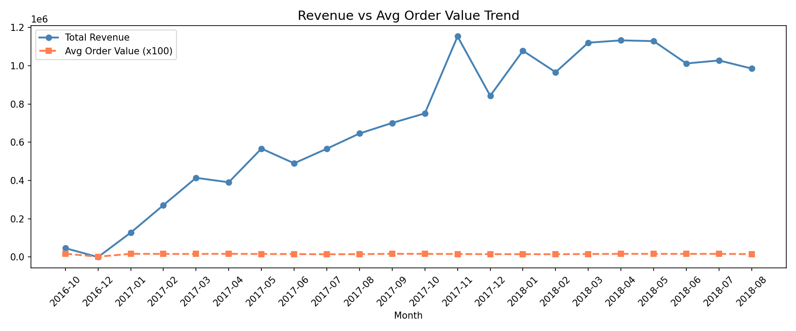
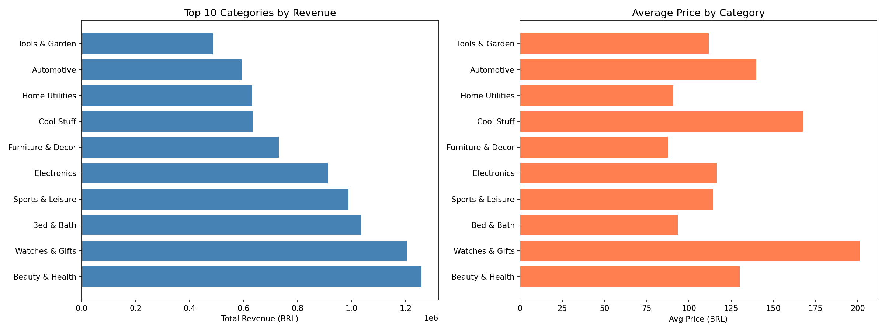
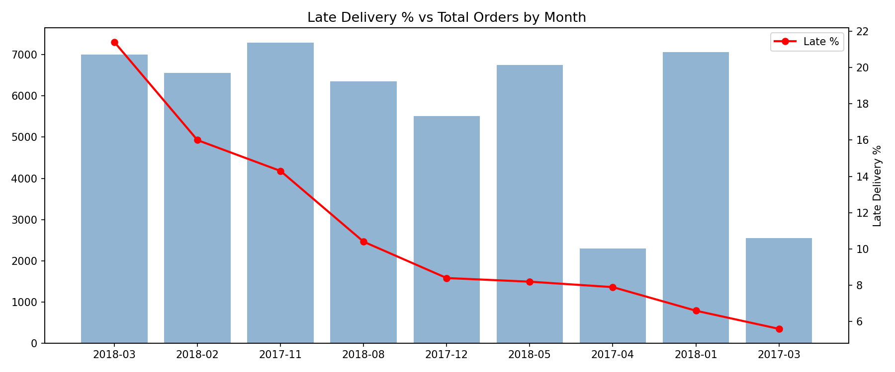
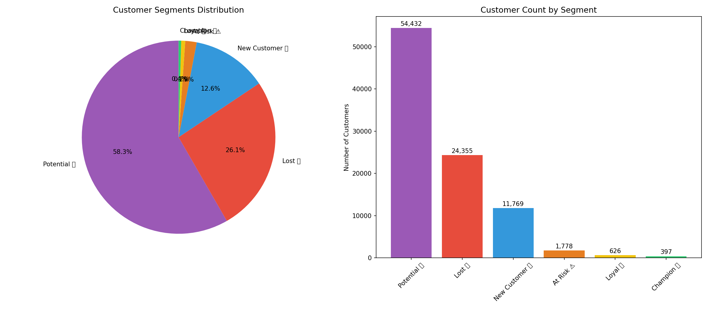

# 🛒 E-Commerce Sales Analysis
**Tools:** SQL · Python · Google Sheets  
**Dataset:** Olist Brazilian E-Commerce (100k+ orders, Kaggle)

---

## 📌 Project Overview
Analyzed 100,000+ real e-commerce orders to uncover revenue trends, 
customer behaviour, delivery performance, and product insights — 
simulating a real Data Analyst workflow from raw data to business 
recommendations.

---

## 🔧 Workflow
```
Raw CSV Files → SQL (SQLiteOnline) → Python (Google Colab) → Dashboard (Google Sheets)
```

---

## 📊 Story 1 — Monthly Revenue Trend



### What I Found
- Revenue grew **10x** from early 2017 to late 2017
- **November 2017** was the peak month — **1.2M BRL** in revenue
- Business stabilized at ~1M BRL/month through 2018

### Business Insight
> November spike was driven by **Black Friday demand**. 
> Post-peak stabilization indicates the business reached a mature growth phase.

### Recommendation
> Olist should plan **advance inventory and logistics capacity** before 
> November every year to handle demand surge without compromising delivery.

---

## 📦 Story 2 — Top Product Categories



### What I Found
| Category | Orders | Revenue | Avg Price |
|---|---|---|---|
| Beauty & Health | 9,670 | 1.25M BRL | 130 BRL |
| Bed & Bath | 11,115 | 1.03M BRL | 93 BRL |
| Watches & Gifts | 5,991 | 1.20M BRL | 201 BRL |
| Electronics | 7,827 | 911k BRL | 116 BRL |

### Business Insight
> **Bed & Bath** leads in volume but **Beauty & Health** leads in revenue.  
> **Watches & Gifts** is a hidden gem — lowest orders but highest avg price (201 BRL).

### Recommendation
> Focus marketing spend on **Watches & Gifts** — high margin, untapped volume potential.  
> Beauty & Health needs retention strategy — high volume but avg price can be improved.

---

## 🚚 Story 3 — Delivery Performance



### What I Found
| Metric | Value |
|---|---|
| Total Delivered Orders | 96,478 |
| Late Orders | 7,826 (8.1%) |
| Avg Actual Delivery | 12.6 days |
| Avg Promised Delivery | 23.7 days |

### Business Insight
> Company delivers **11 days earlier** than promised — smart under-promise, over-deliver strategy.  
> However **March 2018 had 21.4% late rate** — possible operational/courier issue.  
> **November 2017 had 14.3% late rate** — Black Friday volume overwhelmed logistics.

### Recommendation
> Build a **Peak Season Logistics Plan** — pre-book courier capacity before November.  
> Investigate March 2018 spike — identify root cause to prevent recurrence.

---

## 👥 Story 4 — Customer Segmentation (RFM Analysis)



### What I Found
| Segment | Customers | % |
|---|---|---|
| 🔵 Potential | 54,432 | 58% |
| 🔴 Lost | 24,355 | 26% |
| 🟢 New Customer | 11,769 | 13% |
| ⚠️ At Risk | 1,778 | 2% |
| 💛 Loyal | 626 | 0.6% |
| 🏆 Champion | 397 | 0.4% |

### Business Insight
> **90%+ customers are one-time buyers** — retention is the biggest problem.  
> **54,432 Potential customers** are the biggest opportunity — they are recent but haven't returned.  
> Only **397 Champions** out of 93,000 customers — 0.4% — critically low loyalty rate.

### Recommendation
> Launch a **win-back email campaign** for 54k Potential customers with a 10% discount.  
> If even 10% convert → **5,400 new repeat customers** → significant long term revenue impact.  
> Create a **VIP loyalty program** for 397 Champions to retain highest value customers.

---

## 💡 Key Takeaways

| # | Insight | Impact |
|---|---|---|
| 1 | Black Friday drives 20%+ annual revenue in one month | High |
| 2 | Watches & Gifts = highest margin category | High |
| 3 | 26% customers are lost — retention problem | Critical |
| 4 | Delivery promise vs reality gap = competitive advantage | Medium |
| 5 | Peak season logistics = operational risk | High |

---

## 📁 Repository Structure
```
ecommerce-sales-analysis/
├── charts/
│   ├── story1_revenue_trend.png
│   ├── story2_categories.png
│   ├── story3_delivery.png
│   └── story4_rfm_segments.png
├── notebooks/
│   └── ecommerce_analysis.ipynb
└── README.md
```

---

## 🗂️ Dataset
[Olist Brazilian E-Commerce — Kaggle](https://www.kaggle.com/datasets/olistbr/brazilian-ecommerce)
